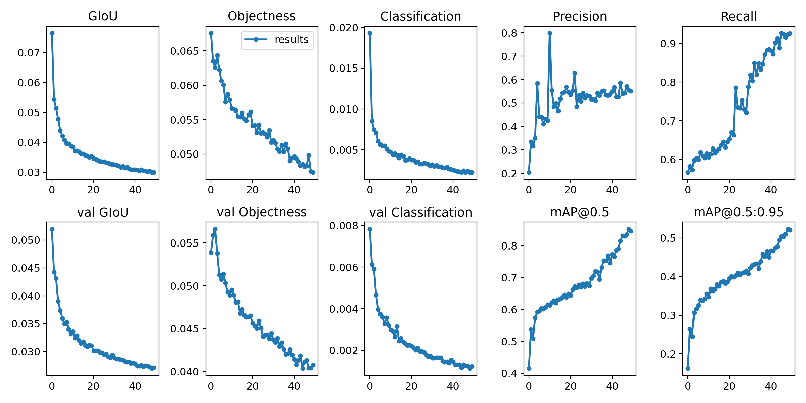
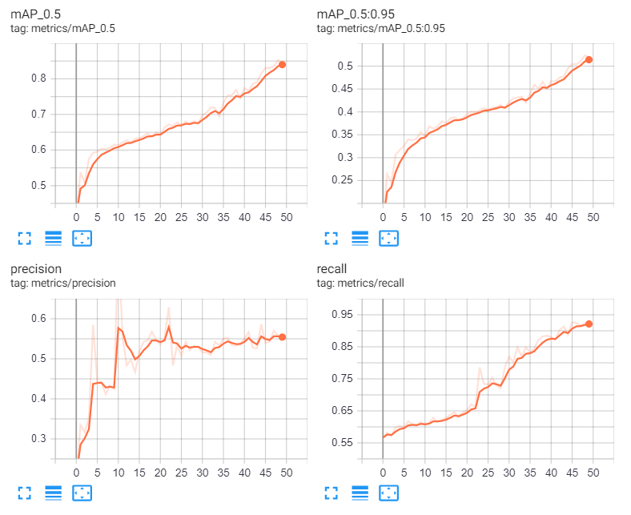
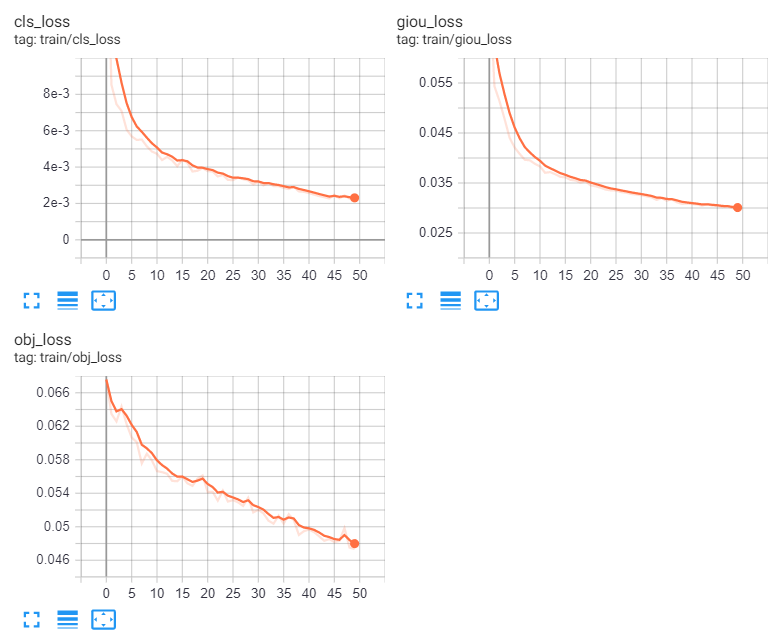
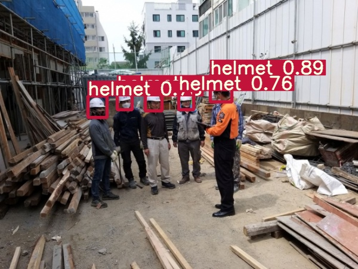

yolov5_custom_detector
===
+ Make custom dataset thru google colab

## How to do
+ Download any dataset from [roboflow](https://public.roboflow.ai/object-detection)
+ Open yolov5_custom_detector.ipynb
+ Run the cells

## Tested by safty helmet dataset
### Result

### Metrics

### Train_loss

### Test_image

### [Download pre-trained dataset](https://github.com/sammiee5311/yolov5_custom_detector/raw/master/best_helmet_yolov5s.pt)

### Reference 
+ https://youtu.be/T0DO1C8uYP8
+ https://public.roboflow.ai/object-detection
+ https://colab.research.google.com/github/ultralytics/yolov5/blob/master/tutorial.ipynb#scrollTo=WwosXmgDahte
+ https://github.com/ultralytics/yolov5
